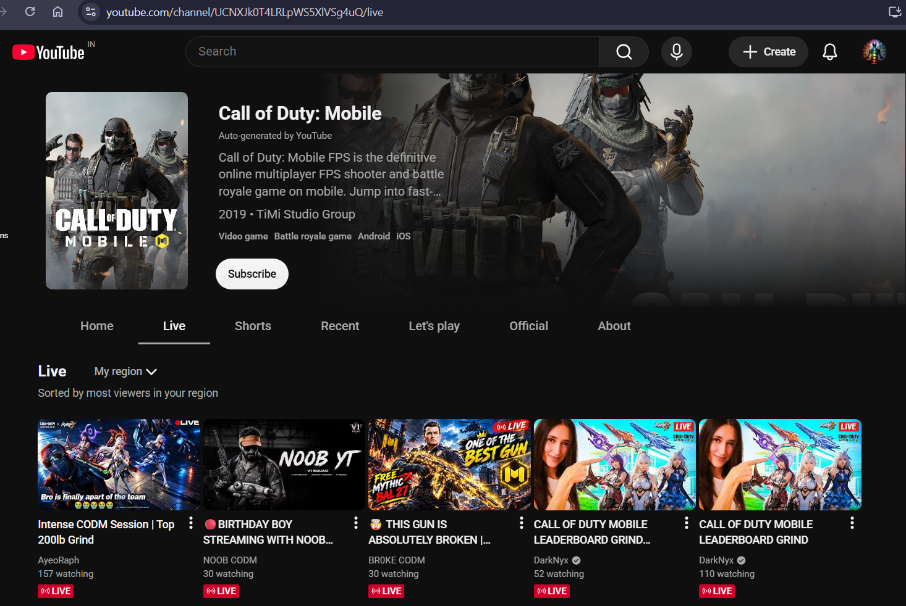

# YouTube creator extractor : version 1.0
(It extracts YouTube creator's business email , instagram url and youtube channel link)

This Node.js script discovers the channels currently listed on the configured YouTube live page, opens each channel, clicks the channel description “More” control, extracts the public creator name, business email, YouTube URL, and Instagram URL, and saves each row immediately to the configured XLSX file.

## Modules

- `src/config.js` loads and validates `.env` settings.
- `src/youtube.js` discovers live channels and reads expanded channel descriptions.
- `src/text.js` normalizes links and extracts email addresses with business-context preference.
- `src/workbook.js` updates or appends rows and writes the workbook after every channel.
- `src/logger.js` provides timestamped structured logs.
- `src/main.js` coordinates browser lifecycle, events, retries, graceful shutdown, and per-channel failures.

## environment file :
1. LIVE_GAMING_CHANNEL_LINK
It should be link to the game page having live channel list for example see the url in address bar:

2. OUTPUT_XLSX_PATH
The path where the excel file will be saved
for e.g yourlocalDirectory/C:users/Desktop/project/output/youtube_creators.xlsx

3. MAX_CHANNEL_EMAILS_TO_GENERATE (optional)
The maximum number of non-empty business-email results to extract in one run. Channels without a public email do not consume the limit. For example, `5` stops after five email results, while `50` allows up to fifty. If omitted or invalid, the run is unlimited.

## Run

1. Install Node.js 18 or newer.
2. In this folder, run `npm install`.
3. If Playwright asks for browsers, run `npx playwright install chromium`.
4. Close the XLSX file if it is open in Excel.
5. Run `npm start`.

The workbook is written after each successful extraction. If the process is interrupted, already-saved rows remain in the XLSX file.

The script does not sign in, solve CAPTCHAs, or infer missing emails. A malformed address is preserved as displayed in the public description so it can be reviewed manually.
